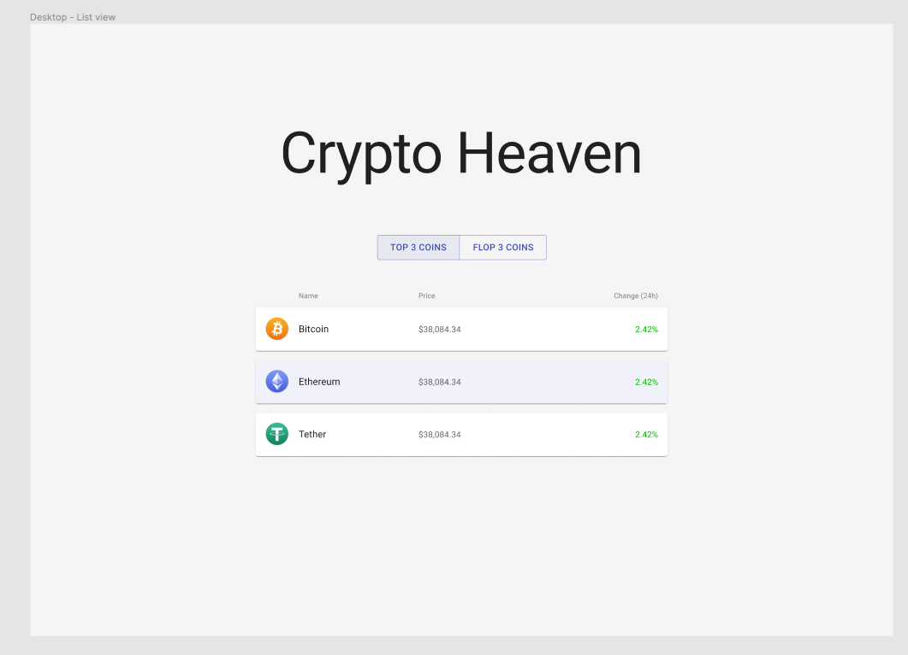
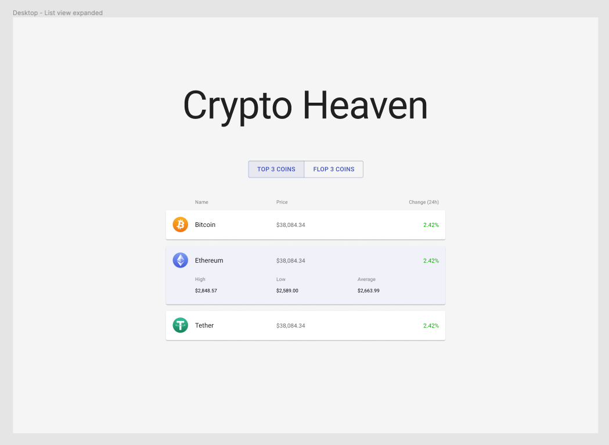
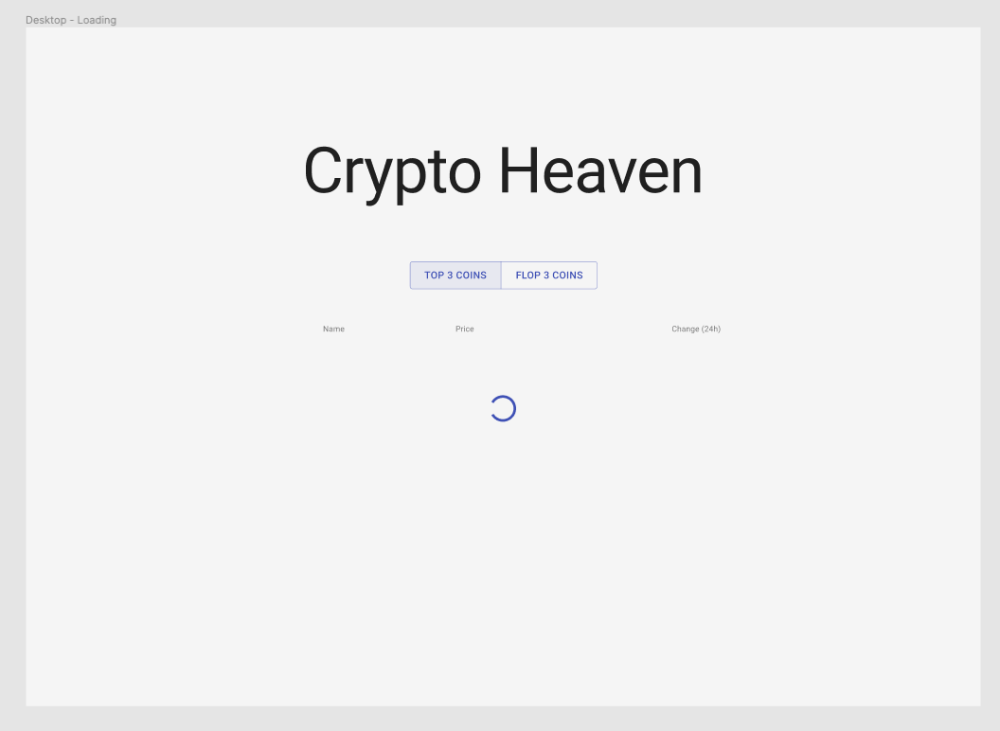
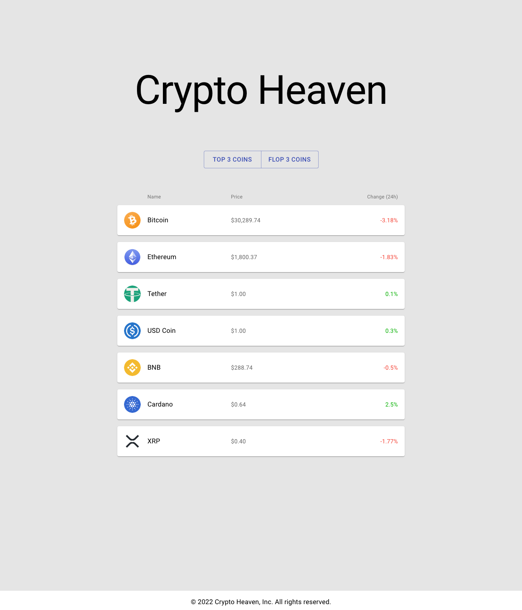
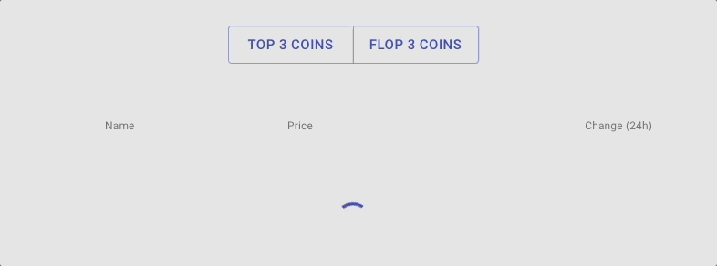
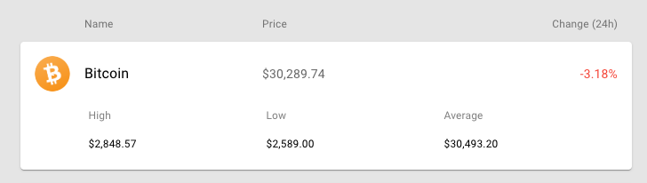

<div align="center">
  
</div>

# Crypto Heaven API

Crypto Heaven API app made during a coding challenge. <br /><br />
It keeps you up to date on the status of some of the main cryptocurrencies with real-time market data and tracking features.

## Technologies

This is a [Next.js](https://nextjs.org/) project bootstrapped with [`create-next-app`](https://github.com/vercel/next.js/tree/canary/packages/create-next-app) using the [TypeScript](https://www.typescriptlang.org) template.

## Setup

First of all clone the repo on your own machine

```bash
git clone https://github.com/lmguerrini/crypto-heaven-api.git
```

Install all the dependencies required

```bash
npm install
```

Start the server

```bash
npm run dev
```

Now you should be ready to dive into the Crypto Heaven API at http://localhost:3000

## Main features

-   Built layout based on a Figma draft as requested during a coding challenge
-   Used Material-UI as main UI library
-   The button group fetch data from the [CoinCap crypto API](https://docs.coincap.io)
-   Loading spinner while the API request is running
-   Clicking a coin card expand the card and show more detailed data
-   Different stagger animation for the coin cards on mount
    <br />

## Preview

### Figma draft

 &emsp;
 &emsp;


### Home

 &emsp;


### Loading / waiting for API response



### Expanded card view



---

[**Back to Crypto Heaven API**](#crypto-heaven-api)
